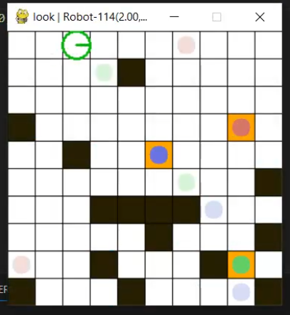
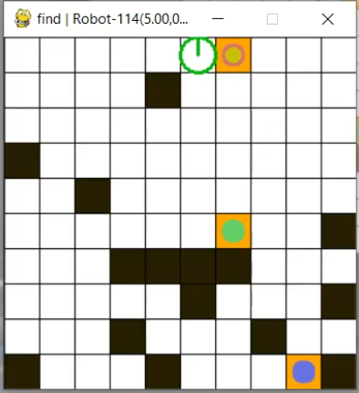

# 3D-Agent-using-MCTS
## Installation
> [!IMPORTANT]
> In order to edit the packages content you must follow this directions:

1. Install Cython:
```
pip install Cython
```

2. Go to the package root directory (where setup.py is located(inside pomdp-py folder)). Run:
```
pip install -e .
```

## Testing 
In order to test the 2D solver you must move to the directory pomdp-py\pomdp_py\problems\multi_object_search
```
cd pomdp-py\pomdp_py\problems\multi_object_search
```
and run problem.py:
```
python -m problem
```
### Expected output:
1. Initial State

   
  > [!TIP]
  > We use different colors to identify different objects. The color intesity rapresents their probability to be found in that spot i.e. the agents belief. 
2. Looks

   
  > Looks are often executed to improve the agents belief.  

3. Final State

   
> [!NOTE]
> The different map configurations are stored and selected in the file pomdp-py\pomdp_py\problems\multi_object_search\maps.py 
